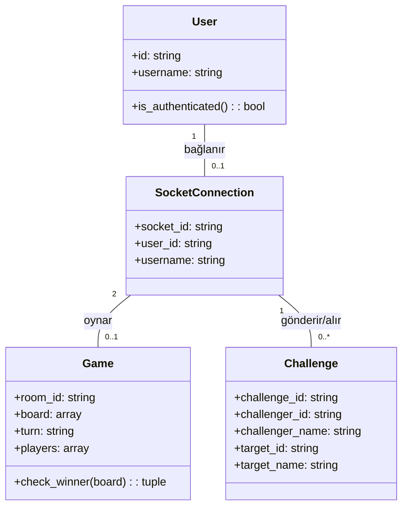
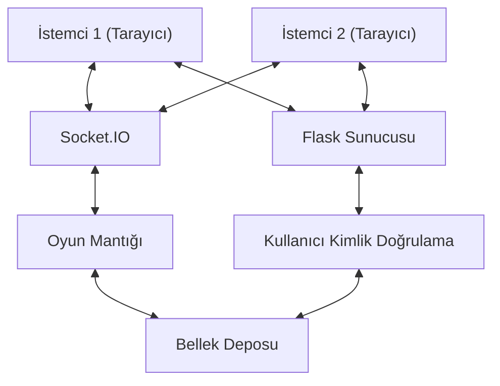
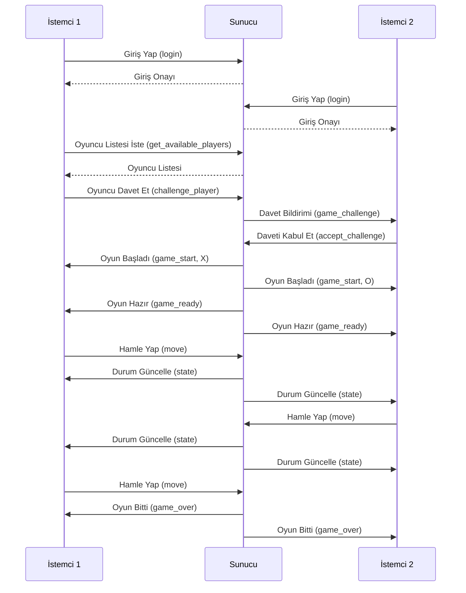
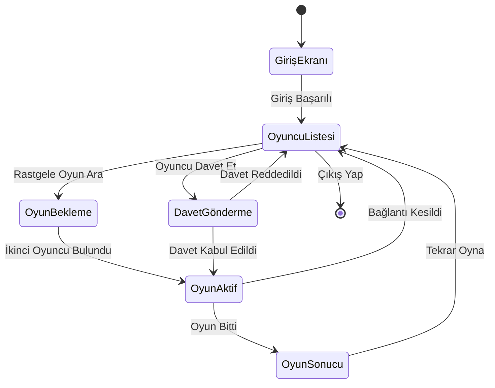
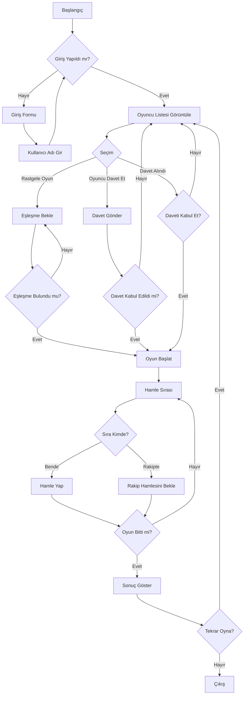

# Hamza_AL_SAKHEN    220206904
# Selin_Agir         220206042

# Tic Tac Toe LAN Oyunu Sunum Dosyası

## 1. Proje Özeti

**Tic Tac Toe LAN Oyunu**, aynı yerel ağdaki iki bilgisayarın tarayıcı üzerinden gerçek zamanlı olarak klasik XOX (Tic Tac Toe) oynamasını sağlayan bir web uygulamasıdır.

### Temel Özellikler

- Kullanıcı girişi ve kimlik doğrulama
- LAN içindeki aktif oyuncuların listesi
- Oyuncu davet sistemi
- Rastgele eşleştirme
- Gerçek zamanlı oyun deneyimi
- Skor takibi
- Oyun sonuçlarının görselleştirilmesi

## 2. Teknoloji Yığını

| Katman       | Teknoloji                                      | Neden?                                         |
| ------------ | ---------------------------------------------- | ---------------------------------------------- |
| **Backend**  | Python 3 + Flask + Flask-SocketIO              | Kurulumu kolay, Socket.IO client'ı JS'te hazır |
| **Frontend** | HTML / CSS / Vanilla JavaScript + Socket.IO    | React vb. gereksiz; tek sayfa yeterli          |
| **Veri**     | RAM içinde dict (bellekte saklama)             | Küçük ölçek, disk kalıcılığı gerekmiyor        |
| **İletişim** | WebSocket (Socket.IO)                          | Gerçek zamanlı, iki yönlü iletişim             |

## 3. UML Diyagramları

### 3.1. Sınıf Diyagramı



### 3.2. Bileşen Diyagramı



### 3.3. Sıralama Diyagramı



### 3.4. Durum Diyagramı



### 3.5. Aktivite Diyagramı



## 4. Veri Yapıları ve API

### 4.1. Veri Yapıları

```javascript
// Oyun durumu
games = {
  "room_id": {
    "board": ["", "", "", "", "", "", "", "", ""],  // 3×3 tahta
    "turn": "X",                                    // Sıradaki oyuncu
    "players": ["socket_id_1", "socket_id_2"]       // Oyuncuların socket ID'leri
  }
}

// Aktif bağlantılar
active_connections = {
  "socket_id": {
    "user_id": "user_uuid",
    "username": "kullanıcı_adı"
  }
}

// Bekleyen davetler
pending_challenges = {
  "challenge_id": {
    "challenger_id": "socket_id_1",
    "challenger_name": "kullanıcı_adı_1",
    "target_id": "socket_id_2",
    "target_name": "kullanıcı_adı_2"
  }
}
```

### 4.2. Socket.IO Olayları

| Olay                  | Yön                | Veri                                      | Açıklama                           |
| --------------------- | ------------------ | ----------------------------------------- | ---------------------------------- |
| `connect`             | client → server    | -                                         | Bağlantı kuruldu                   |
| `disconnect`          | client → server    | -                                         | Bağlantı kesildi                   |
| `get_available_players` | client → server  | -                                         | Aktif oyuncuları iste              |
| `available_players`   | server → client    | `{players: [{id, user_id, username}]}`    | Aktif oyuncu listesi               |
| `challenge_player`    | client → server    | `{player_id}`                             | Oyuncu davet et                    |
| `game_challenge`      | server → client    | `{challenge_id, from_username, from_id}`  | Davet bildirimi                    |
| `accept_challenge`    | client → server    | `{challenge_id}`                          | Daveti kabul et                    |
| `reject_challenge`    | client → server    | `{challenge_id}`                          | Daveti reddet                      |
| `find_game`           | client → server    | -                                         | Rastgele eşleşme iste              |
| `game_start`          | server → client    | `{room, symbol}`                          | Oyun başladı, sembol atandı        |
| `game_ready`          | server → room      | `{room}`                                  | İki oyuncu hazır, oyun başlıyor    |
| `move`                | client → server    | `{room, index}`                           | 0-8 arası hamle                    |
| `state`               | server → room      | `{board, turn}`                           | Güncel tahta + sıradaki            |
| `game_over`           | server → room      | `{winner, line, board, message}`          | Sonuç bildir                       |

## 5. Kullanıcı Arayüzü

### 5.1. Ekranlar

1. **Giriş Ekranı**
   - Kullanıcı adı girişi
   - Giriş butonu

2. **Ana Ekran**
   - Kullanıcı bilgileri ve skor
   - Aktif oyuncular listesi
   - Oyun arama butonu

3. **Oyun Ekranı**
   - 3x3 oyun tahtası
   - Oyun durumu bilgisi
   - Oyuncu sembolleri (X/O)
   - Sıra göstergesi

4. **Sonuç Ekranı**
   - Kazanan/beraberlik bildirimi
   - Kazanan çizgisinin vurgulanması
   - Tekrar oynama butonu

### 5.2. Kullanıcı Akışı

1. Kullanıcı giriş yapar
2. Aktif oyuncular listelenir
3. Kullanıcı ya rastgele eşleşme ister ya da bir oyuncuyu davet eder
4. Oyun başlar, ekran tam ekran oyun moduna geçer
5. Oyuncular sırayla hamle yapar
6. Oyun sonuçlanır ve sonuç ekranı gösterilir
7. Kullanıcı tekrar oynayabilir veya çıkış yapabilir

## 6. Güvenlik ve Hata Yönetimi

### 6.1. Güvenlik Önlemleri

- **Kullanıcı Kimlik Doğrulama**: Flask-Login ile oturum yönetimi
- **Hamle Doğrulama**: Sunucu tarafında tüm hamlelerin geçerliliği kontrol edilir
- **Oda Erişim Kontrolü**: Sadece ilgili oyuncular odaya erişebilir

### 6.2. Hata Yönetimi

- **Bağlantı Kopması**: Oyuncu düştüğünde otomatik olarak oyun sonlandırılır
- **Geçersiz Hamleler**: Sunucu tarafında filtrelenir
- **Davet Çakışmaları**: Aktif oyun sırasında davetler engellenir

## 7. Performans ve Ölçeklenebilirlik

### 7.1. Performans İyileştirmeleri

- Gereksiz oyuncu listesi güncellemeleri engellenir
- Oyun aktif olduğunda sadece gerekli veriler gönderilir
- Verimli Socket.IO kullanımı

### 7.2. Ölçeklenebilirlik Sınırlamaları

- Bellekte saklama nedeniyle sunucu yeniden başlatıldığında veriler kaybolur
- Tek sunucu mimarisi, yüksek yük altında performans düşebilir
- Çok sayıda eşzamanlı oyun için optimize edilmemiştir

## 8. Gelecek Geliştirmeler

- Veritabanı entegrasyonu ile kalıcı kullanıcı profilleri
- Oyuncu istatistikleri ve liderlik tablosu
- Özelleştirilebilir oyun tahtaları ve semboller
- Sohbet özelliği
- Farklı oyun modları (zaman sınırlı, özel kurallar)
- Mobil uyumluluk iyileştirmeleri

## 9. Kurulum ve Çalıştırma

### 9.1. Gereksinimler

- Python 3.6+
- Flask
- Flask-SocketIO
- Python-SocketIO
- Eventlet
- Flask-Login

### 9.2. Kurulum Adımları

```bash
# Sanal ortam oluştur
python -m venv venv

# Sanal ortamı etkinleştir
# Windows:
venv\Scripts\activate
# Linux/Mac:
source venv/bin/activate

# Bağımlılıkları yükle
pip install -r requirements.txt

# Uygulamayı çalıştır
python app.py
```

### 9.3. Erişim

- Sunucu: `http://0.0.0.0:5000/`
- İstemciler: `http://<SUNUCU_IP>:5000/`

## 10. Demo Senaryosu

1. İki farklı bilgisayarda tarayıcı açın
2. Her birinde kullanıcı adı girerek giriş yapın
3. Bir bilgisayarda diğer oyuncuyu davet edin
4. Daveti kabul edin ve oyunun başladığını görün
5. Sırayla hamleler yaparak oyunu tamamlayın
6. Kazananın gösterildiğini ve skorun güncellendiğini görün
7. Tekrar oyna butonuna tıklayarak yeni bir oyun başlatın

## 11. Sonuç

Tic Tac Toe LAN oyunu, modern web teknolojilerini kullanarak klasik bir oyunu yerel ağ üzerinden çok oyunculu hale getiren bir uygulamadır. Socket.IO ile gerçek zamanlı iletişim, Flask ile kolay web sunucusu yönetimi ve sade bir kullanıcı arayüzü ile kullanıcılar için keyifli bir deneyim sunar. Proje, basit görünmesine rağmen gerçek zamanlı web uygulamalarının temel prensiplerini ve WebSocket iletişiminin nasıl kullanılacağını göstermektedir. 
